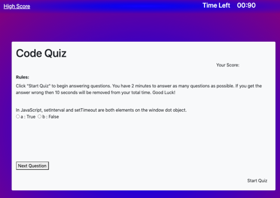
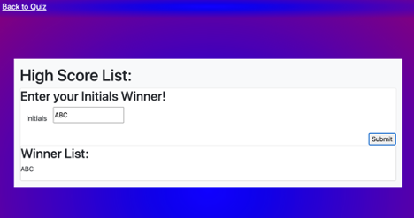

# CodeQuiz

Create a quiz with multiple questions and a score based on time constraint

Installation:

- index.html, script.js, and style.css
- Access from: https://jericfey.github.io/CodeQuiz

Summary:

- This is a responsive web page using javascript and jQuery

Usage:

- Select the "Start Quiz" button in order to play. As soon as you start the quiz a timer will begin counting down. You will be asked questions and if you get the question correct, you go to the next question. If you get the question wrong then you lose 10 seconds off of the timer. When the timer reaches 0 the game is over. You can save your initials and score in the High Score list.

Screenshots:

